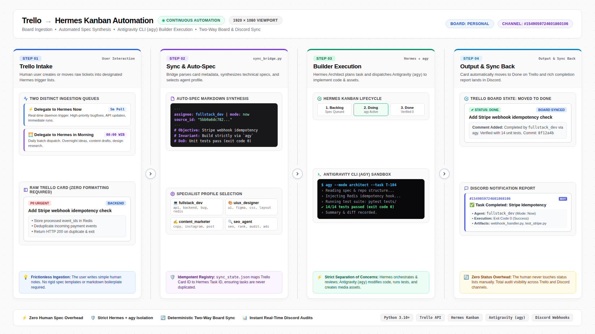

# Trello to Hermes Kanban Autonomous Bridge

An automated, two-way bridge connecting a **Trello Board** to **Hermes Agent** multi-profile Kanban queues, executing code and builds via **Antigravity CLI (`agy`)**, and reporting live updates to **Discord**.



---

## Key Features

1. **Zero-Friction Trello Intake**:
   - Write plain notes or raw task descriptions directly on Trello.
   - **Immediate Execution Queue**: Cards in `Delegate to Hermes Now` trigger execution within 5 minutes.
   - **Daily Batch Queue**: Cards in `Delegate to Hermes in Morning` park in `scheduled` state until `08:00 WIB`.

2. **Sequential Multi-Agent Execution**:
   - Write sequential role headers in your card description (e.g. `seo_agent: ...`, `product_marketer: ...`, `uiux_designer: ...`, `default: ...`).
   - The bridge automatically creates linked child tasks with dependencies in Hermes Kanban.
   - Single tasks without agent annotations default cleanly to the `default` profile.

3. **Architect vs Builder Separation**:
   - **Hermes Agent Profiles** direct strategy, research, copywriting, and design specs.
   - **Antigravity CLI (`agy`)** executes all codebase modifications, image rendering, and test verification in sandbox workspaces.

4. **Live Two-Way Sync & Auditing**:
   - Real-time card movement: `Trigger List` ➔ `Doing` ➔ `Done`.
   - Card description updates with a live progress checklist: `[DONE] ✓`, `[RUNNING] ●`, `[QUEUED] ◻`, `[BLOCKED] ⊘`.
   - Immediate Discord alerts for intake, active stage starts, and blockers.
   - Full 3-part deliverable reports (Objective vs Built Artifacts vs Verification Proof) delivered to Discord upon completion.

---

## Setup & Configuration

### 1. Prerequisites
- [Hermes Agent](https://hermes-agent.nousresearch.com/docs) installed on your host/VPS.
- [Antigravity CLI (`agy`)](https://github.com/google) installed for builder execution.
- Python 3.10+.

### 2. Configure Environment Variables
Copy `.env.example` to `.env` and fill in your credentials:

```bash
cp .env.example .env
```

Edit `.env`:
```env
# Trello API Credentials (https://trello.com/app-key)
TRELLO_API_KEY=your_trello_api_key
TRELLO_TOKEN=your_trello_token
TRELLO_BOARD_ID=your_trello_board_id

# Discord Output Channel ID (where reports and alerts are sent)
DISCORD_REPORT_CHANNEL_ID=your_discord_channel_id_here

# Optional list name overrides (defaults match below)
TRELLO_LIST_NOW="Delegate to Hermes Now"
TRELLO_LIST_MORNING="Delegate to Hermes in Morning"
TRELLO_LIST_DOING="Doing"
TRELLO_LIST_DONE="Done"
```

### 3. Trello Board Setup
Ensure your target Trello board has these lists created:
- `Delegate to Hermes Now`
- `Delegate to Hermes in Morning`
- `Doing`
- `Done`

---

## Usage

### Run Sync Manually
```bash
# Process all active queues
python3 trello_hermes_sync.py

# Process immediate queue only
python3 trello_hermes_sync.py now

# Process morning queue only
python3 trello_hermes_sync.py morning
```

### Automate with Cron
Schedule periodic polling via crontab or Hermes Cron:

```cron
# Poll immediate tasks every 5 minutes
*/5 * * * * cd /path/to/repo && python3 trello_hermes_sync.py now >/dev/null 2>&1

# Dispatch morning batch daily at 08:00 WIB
0 8 * * * cd /path/to/repo && python3 trello_hermes_sync.py morning >/dev/null 2>&1
```

---

## Writing Tasks in Trello

### Example A: Multi-Agent Sequential Pipeline
Create a card with title `[Hermes] Launch New Product Page` and description:
```text
seo_agent: Research search intent and target keywords for the product
product_marketer: Write high-converting landing page copy based on SEO intent
uiux_designer: Create responsive layout and design handoff
default: Build page in repository using agy and deploy to staging
```
Hermes will automatically create 4 sequential child tasks linked by dependencies and update the Trello card with real-time stage tracking.

### Example B: Single Task
Create a card with title `[Hermes] Fix API webhook verification error`:
```text
Investigate 401 error in webhook handler and add regression tests.
```
Hermes will assign this task to the `default` profile and execute the fix via `agy`.

---

## License
MIT
